# Latest Creator Monetization Platform Compilation (Including Multi-Format Pricing)

You've built an audience on social media, shared your expertise for free for months, and watched engagement numbers climb. But when rent's due, likes don't pay bills. The classic monetization paths—brand deals, ads, sponsorships—mean waiting for others to decide your worth and take massive cuts of what you earn. You're stuck choosing between staying authentic to your community or chasing whatever sponsors will actually pay for, even when it doesn't align with what you actually teach.

Creator monetization platforms flip this model by letting you sell directly to your audience—courses, coaching sessions, memberships, digital products—keeping control over pricing and content while building sustainable income. The best platforms handle payment processing, content hosting, and student management so you focus on creating rather than wrestling with tech setup. Whether you're teaching yoga, business strategy, or creative skills, these tools transform expertise into reliable revenue streams.

---

## **[Wooskill](https://www.wooskill.com/creators)**

All-in-one French platform for coaches and experts monetizing live sessions and pre-recorded content.

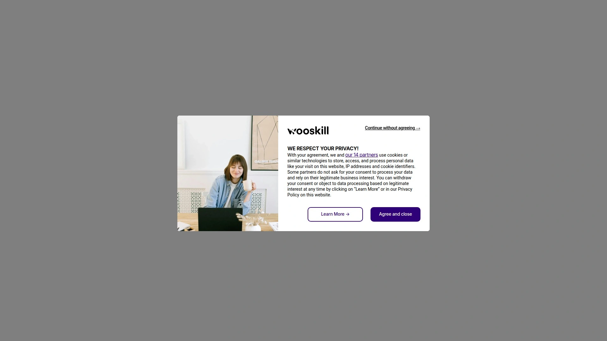

Wooskill positions itself at the intersection of education technology and the creator economy, serving over 25,000 creators across 350 different skill categories. The platform stands out by offering multiple monetization formats within one system—live coaching sessions via video, masterclasses for groups, pre-recorded courses, and ongoing membership programs. This flexibility matters when your audience wants different learning experiences, from one-on-one attention to self-paced studying.

The personal account manager support distinguishes Wooskill from self-service competitors. Each creator gets dedicated help with profile optimization, pricing strategy, format selection, and communication tactics. This hands-on assistance accelerates results for creators lacking marketing backgrounds or technical expertise. The platform handles hosting, payment processing, and student management while you concentrate on content delivery and community engagement.

Wooskill's rapid growth—40-fold business increase in one year—signals strong demand for their model. The 200,000 monthly active users provide built-in discovery potential, though successful creators still drive their own traffic from established social followings. French market focus means the platform particularly serves European creators and audiences, with features and support optimized for that region. For coaches, consultants, and experts wanting comprehensive tools plus ongoing strategic support, Wooskill delivers infrastructure and guidance simultaneously.

***

## **[Thinkific](https://thinkific.com)**

Feature-rich course platform with AI content generation and native email marketing.

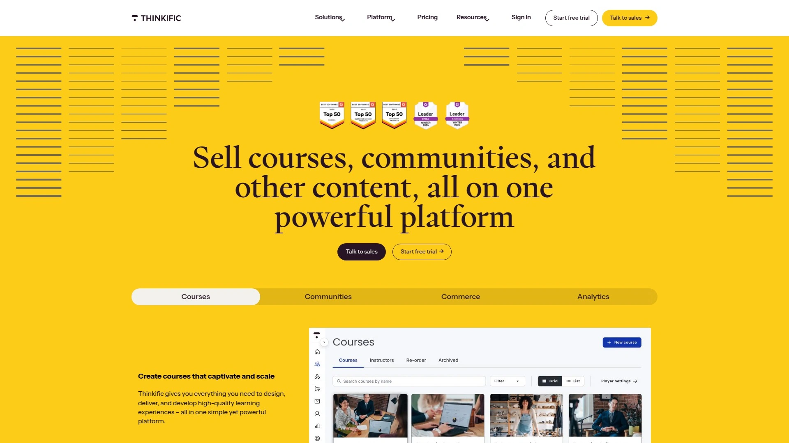

Thinkific combines course creation, website building, and marketing automation in one ecosystem. The AI-powered course builder drafts initial content from your existing materials, cutting setup time substantially. Drag-and-drop lesson creation supports videos, PDFs, quizzes, assignments, and prerequisites. Drip content scheduling releases lessons gradually, improving completion rates by preventing overwhelm.

The built-in email marketing eliminates paying for separate tools like Mailchimp or ConvertKit. Segment audiences based on course progress, send abandoned cart reminders, and run launch campaigns without leaving the platform. Community features let you build discussion forums directly inside your course area. Live events integration supports hosting webinars and group coaching alongside self-paced content.

Pricing starts at $49 monthly, positioning Thinkific as mid-range—more expensive than basic tools but less than enterprise solutions. The investment makes sense when you calculate savings from avoiding separate hosting, email marketing, and community platforms. Unlimited courses and students on all plans mean you scale revenue without escalating platform costs. For creators prioritizing professional polish and comprehensive features over absolute simplicity, Thinkific delivers depth without overwhelming complexity.

***

## **[Kajabi](https://kajabi.com)**

Premium all-in-one platform combining courses, marketing funnels, and CRM for serious businesses.

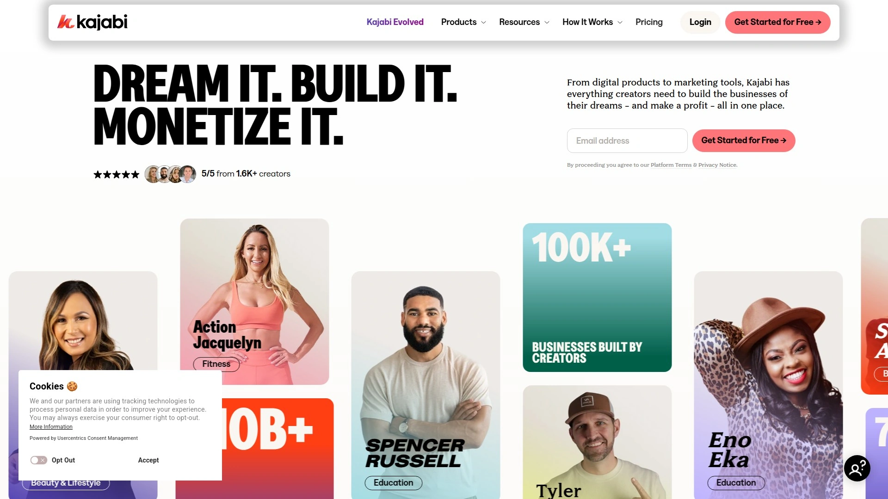

Kajabi targets established creators building substantial businesses, not hobbyists testing ideas. The $119 monthly starting price reflects enterprise-grade capabilities—complete marketing automation, sales funnel builders, email sequences, pipeline management, and native payment processing. You're buying unified infrastructure replacing five separate tools, which justifies costs for creators earning consistent revenue.

The platform excels at creating cohesive customer journeys. Build landing pages that convert visitors into email subscribers, nurture them through automated sequences, sell courses or coaching packages, then upsell to higher-tier memberships—all tracked in one dashboard. The CRM shows exactly where each prospect sits in your sales process. Live coaching sessions integrate seamlessly with course content, perfect for hybrid models combining self-study with group calls.

The learning curve runs steeper than simpler alternatives because Kajabi offers more configuration options and advanced features. However, extensive training materials and active community support help you master the system. Mobile apps for iOS and Android let students access content anywhere. For creators ready to operate like real businesses with sophisticated marketing and multiple revenue streams, Kajabi provides the infrastructure to scale significantly.

***

## **[Teachable](https://teachable.com)**

Straightforward course platform favored by beginners for intuitive setup and reasonable pricing.

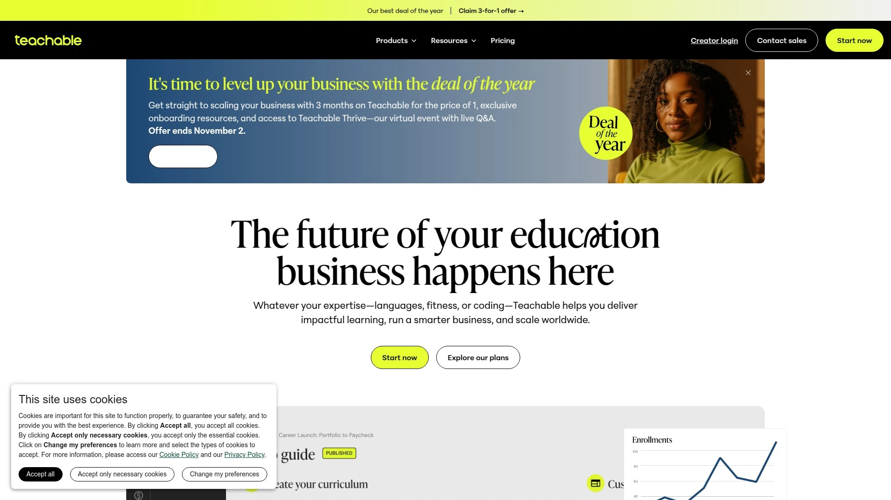

Teachable strips away complexity, making it approachable for creators launching their first digital product. The step-by-step course creation wizard walks you through uploading videos, writing descriptions, setting pricing, and publishing—no technical knowledge required. The interface feels clean and uncluttered compared to feature-heavy competitors. Get your course live in hours rather than days struggling with confusing dashboards.

Payment plans and subscription billing come standard, letting students spread costs over time. This flexibility often increases enrollment by reducing the psychological barrier of upfront payments. Integrated sales pages and checkout remove the need for separate landing page builders. Basic email marketing features handle transactional emails and simple campaigns, though serious marketers eventually want more robust tools.

The free plan lets you test the platform indefinitely, charging transaction fees on sales instead of monthly subscriptions. Paid plans starting at $59 monthly eliminate transaction fees and unlock additional features like custom domains and certificates. For creators prioritizing quick launch over advanced marketing automation, Teachable delivers functional simplicity without sacrificing core capabilities needed to sell courses successfully.

***

## **[Patreon](https://patreon.com)**

Subscription-based creator platform building recurring income through tiered membership levels.

Patreon invented the direct fan funding model that now dominates creator monetization. Fans pledge monthly amounts in exchange for exclusive content, early access, behind-the-scenes material, and community interaction. The tiered system lets you segment audiences—$5 supporters get one reward level, $25 backers receive more, and $100 patrons access everything including direct communication.

The recurring revenue model provides income stability unlike one-time product sales. Knowing you'll collect $3,000 monthly from 200 patrons lets you plan long-term projects and quit side hustles. The platform handles billing automatically, chasing failed payments and managing cancellations without manual intervention. Integration with Discord, YouTube, and other platforms extends your membership benefits beyond Patreon itself.

Discovery remains weak—you bring your own audience rather than finding new patrons through platform browsing. Fees reach 12% on basic plans when combining platform cuts with payment processing. The model works best for creators consistently producing content rather than selling one-time products. Podcasters, artists, writers, and video creators find Patreon's structure aligns naturally with their content creation rhythm and community expectations.

***

## **[Udemy](https://udemy.com)**

Global course marketplace providing instant access to millions of learners but controlling pricing.

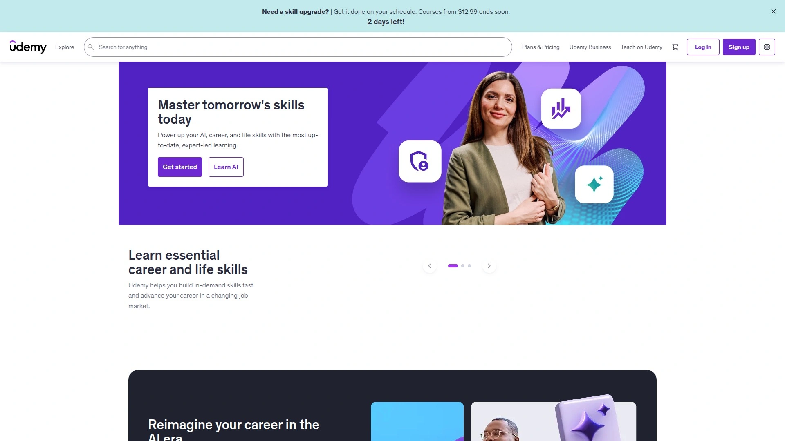

Udemy functions as the Amazon of online courses—massive built-in traffic, aggressive promotion, but platform rules limit creator control. Publishing courses gives you access to 70+ million learners actively searching for education. This discovery potential means passive income from courses created years ago, still generating sales without ongoing marketing effort from you.

The significant tradeoff involves pricing control. Udemy frequently discounts courses to $9.99 during sales, regardless of your listed price. While this drives volume, it devalues content and trains students to wait for discounts. Revenue splits vary—you keep 97% of sales from your own marketing but only 37% of sales Udemy generates through their channels. This structure incentivizes driving your own traffic while benefiting from platform discovery.

Course quality standards remain high. Udemy reviews submissions for production value, accuracy, and student engagement before approval. This quality control maintains platform reputation but means amateur productions get rejected. For creators willing to sacrifice pricing flexibility and revenue percentage in exchange for massive reach and passive discovery, Udemy delivers volume that self-hosted platforms rarely match.

***

## **[Podia](https://podia.com)**

Simple all-in-one platform for courses, digital downloads, and memberships without transaction fees.

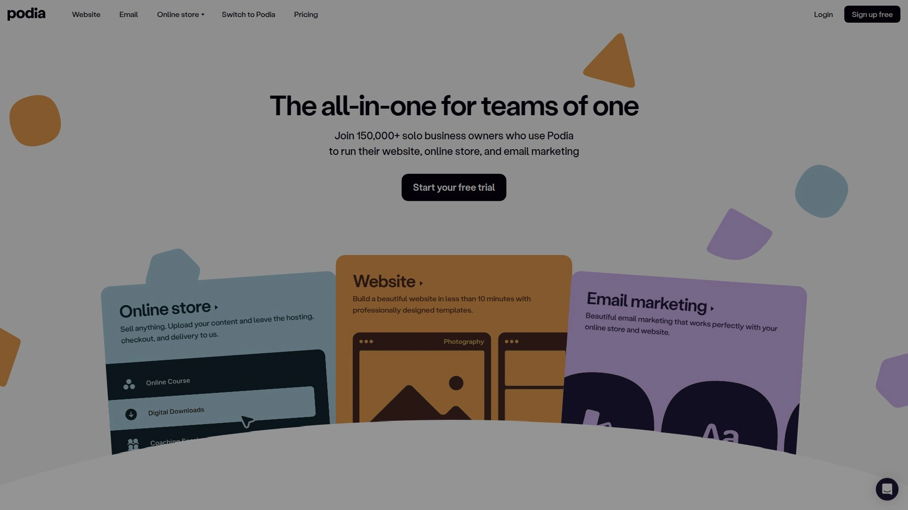

Podia emphasizes straightforward functionality over advanced features. Sell online courses, digital products like ebooks and templates, memberships, and webinars from one platform. The unified dashboard manages everything without juggling separate tools. Clean design and intuitive navigation mean you're creating content within hours of signing up, not days later after watching tutorial videos.

Zero transaction fees on paid plans distinguish Podia from competitors charging percentages of sales. This flat-rate pricing ($39 monthly) becomes increasingly valuable as revenue grows. Email marketing features handle basic campaigns and automated sequences. The built-in website and checkout pages eliminate needing WordPress or separate landing page tools. Community features provide simple forum-style discussions.

Advanced marketers eventually outgrow Podia's capabilities—the automation and segmentation options lack depth compared to platforms like Kajabi. However, this simplicity attracts creators wanting to launch quickly without analysis paralysis from endless customization options. The free migration service transfers existing courses from competitors, reducing switching friction. For solopreneurs seeking functional simplicity with fair pricing, Podia delivers essentials without bloat.

***

## **[Gumroad](https://gumroad.com)**

Creator-friendly platform for selling digital products and subscriptions with minimal setup friction.

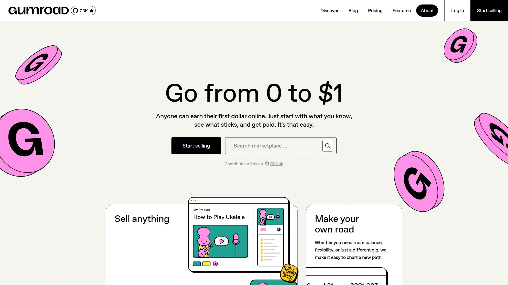

Gumroad handles digital product sales with remarkable simplicity—upload files, set prices, share the link, collect money. The straightforward approach works perfectly for ebooks, templates, design assets, music, and other downloadable products. No website required; Gumroad-hosted product pages handle everything from display to checkout. This minimalism appeals to creators wanting to sell quickly without building elaborate funnels.

Subscription functionality supports recurring revenue models alongside one-time purchases. The email marketing features let you communicate with customers directly through the platform. Workflow tools automate license key delivery for software, membership access for subscription content, and download links for digital files. Pay-what-you-want pricing experiments work smoothly when appropriate for your audience.

The fee structure—10% of sales on free plans, 8.5% plus $10 monthly on paid plans—costs more percentage-wise than competitors charging flat monthly rates. However, the zero setup friction and immediate launching capability make Gumroad ideal for testing product ideas before committing to comprehensive platforms. Creators selling primarily digital products rather than courses find Gumroad's focused feature set matches their needs better than overcomplicated course platforms.

***

## **[Skillshare](https://skillshare.com)**

Creative-focused course marketplace paying creators based on student engagement minutes.

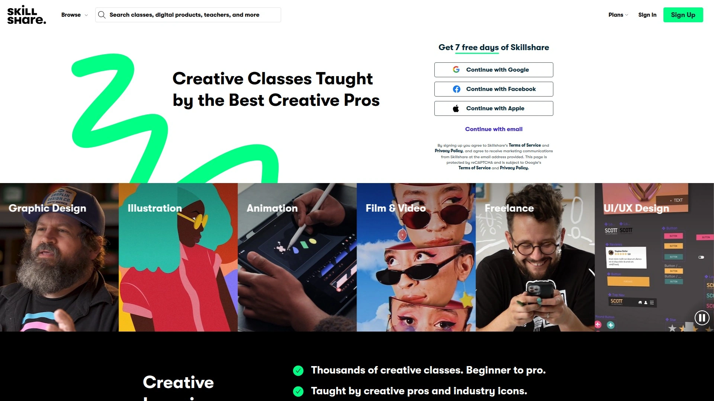

Skillshare targets creative skills—illustration, photography, design, writing, animation—rather than business or technical topics. The platform's aesthetic and community vibe attract students wanting artistic development. Publishing courses grants access to millions of subscribers actively browsing for creative inspiration and skill development. This built-in audience provides discovery smaller creators struggle to generate independently.

The unique payment model calculates earnings from minutes students watch your content rather than course purchases. Skillshare divides its membership revenue pool among creators proportionally based on viewing time. This means compelling content keeping students engaged earns more than courses students abandon after preview lessons. The model rewards teaching effectiveness over aggressive marketing.

Production expectations emphasize visual appeal and tight editing over comprehensive depth. Skillshare courses typically run shorter—30-60 minutes—compared to multi-hour offerings on other platforms. Students expect project-based learning producing tangible outputs. For creative professionals wanting exposure within a community of fellow artists and designers, Skillshare provides cultural fit and audience quality that general marketplaces lack.

***

## **[CoachHub](https://coachhub.com)**

Enterprise coaching marketplace connecting certified professionals with corporate clients.

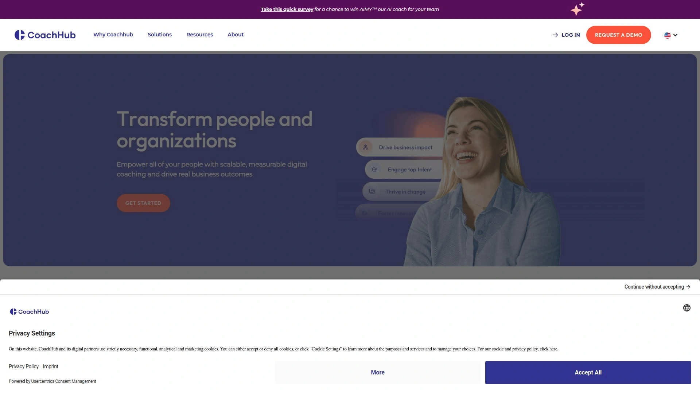

CoachHub serves the corporate coaching market rather than individual consumers. The platform partners with Fortune 500 companies providing professional development coaching for employees and executives. AI matching technology connects coaches with appropriate clients based on specialization, industry experience, and development goals. This eliminates the client acquisition challenge plaguing independent coaches.

Requirements are substantial—coaching certification, 500+ hours experience, and 6+ years managerial background. The vetting process maintains quality standards corporate clients expect. Average coach salaries around $60,000 annually reflect the professional tier CoachHub occupies. You're essentially becoming a contractor for large organizations through the platform rather than hustling for individual clients.

The tradeoff involves less autonomy compared to independent practice. CoachHub sets pricing, provides clients, and manages scheduling. However, this structure delivers consistent income and eliminates marketing entirely. For certified coaches wanting steady corporate work without running a business, CoachHub transforms coaching expertise into employee-like reliability with contractor flexibility.

***

## **[Mighty Networks](https://mightynetworks.com)**

Community-first platform combining courses, memberships, and events under unified brand.

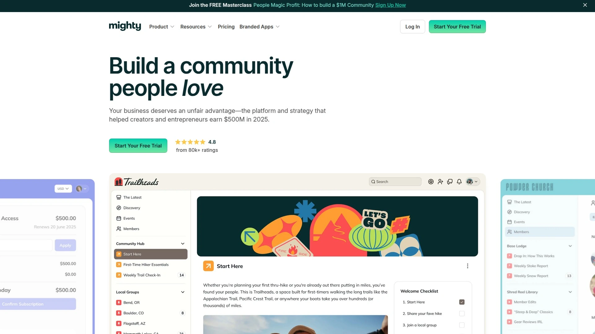

Mighty Networks prioritizes community building over simple course delivery. Create dedicated spaces where members interact, courses provide structured learning, and live events foster real-time connection. The match-making features connect members based on interests, location, and goals, facilitating organic relationship formation beyond just consuming your content.

Native live streaming, polls, Q&A features, and customizable activity feeds make communities feel alive rather than static repositories. The mobile apps for iOS and Android keep members engaged beyond desktop sessions. White-label options remove Mighty Networks branding, presenting everything under your brand. The platform suits creators whose value proposition centers on community experience and peer connection rather than just information transfer.

Pricing starts higher than simple course platforms because you're building comprehensive member experiences. The investment makes sense when community engagement directly drives retention and referrals. Coaches, consultants, and educators finding that student success depends on peer support and ongoing engagement beyond course content find Mighty Networks' architecture aligns with their teaching philosophy and business model.

***

## **[Circle](https://circle.so)**

Modern community platform with course functionality optimized for creator-led learning experiences.

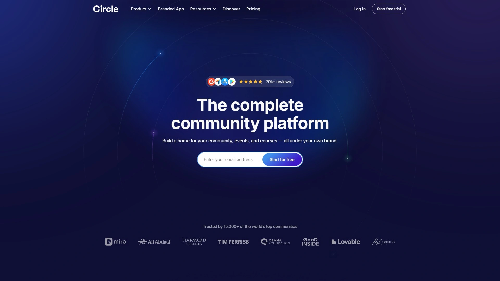

Circle delivers polished community spaces where courses feel like natural extensions of conversation rather than separate products. The interface emphasizes clean design and smooth user experience. Upload video content faster than competitor platforms, important when publishing frequently. Course modules integrate directly into community spaces, keeping students engaged within single environment.

Discussion features feel more sophisticated than basic forum software. Members create rich posts mixing text, video, and file attachments. Spaces organize different topics and access levels cleanly. The platform works particularly well for cohort-based learning where student interaction matters as much as instructor content. Live event features support synchronous sessions alongside asynchronous courses.

The target audience skews toward growing creators and online coaches rather than enterprises or beginners. Pricing reflects this positioning—more expensive than entry-level tools but less than enterprise solutions. The focused feature set avoids overwhelming users with every possible option while delivering depth where it matters for community-driven education. For creators knowing community engagement drives results, Circle provides infrastructure supporting that approach without forcing it.

***

## **[Memberful](https://memberful.com)**

WordPress-friendly membership management focusing on subscription content and recurring revenue.

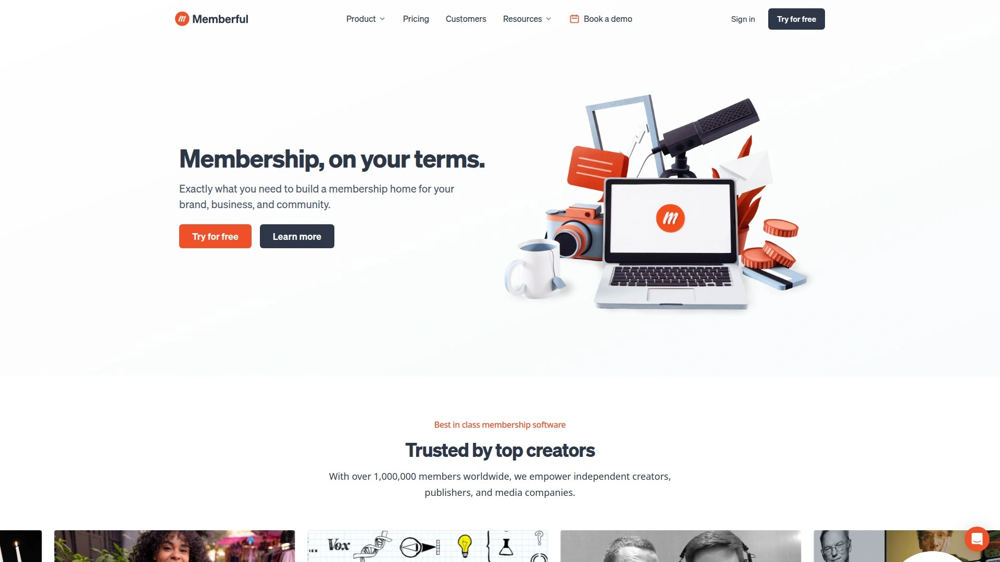

Memberful excels at adding membership functionality to existing WordPress sites without requiring complete platform migration. Install the plugin, configure membership tiers, and start selling subscriptions for exclusive content. This integration approach preserves your existing website, SEO value, and content while adding monetization layers. The hosted option works for non-WordPress users too.

The flat pricing of $49 monthly plus 4.9% transaction fees becomes economical as membership grows. Unlike percentage-based models taking larger cuts from success, Memberful's structure keeps more revenue with creators as businesses scale. Unlimited members and membership plans on all tiers mean no surprise cost increases when hitting arbitrary limits. The newsletter feature replicates Substack's combined email and web publishing approach.

Advanced marketing automation requires separate tools since Memberful focuses specifically on membership management rather than trying to be everything. However, integrations with email platforms, analytics tools, and content management systems extend functionality as needed. For creators with established WordPress presences wanting to add membership tiers without abandoning their existing infrastructure, Memberful slots in seamlessly while handling complex subscription management.

***

## **[Substack](https://substack.com)**

Newsletter platform enabling writers to charge subscriptions for exclusive content.

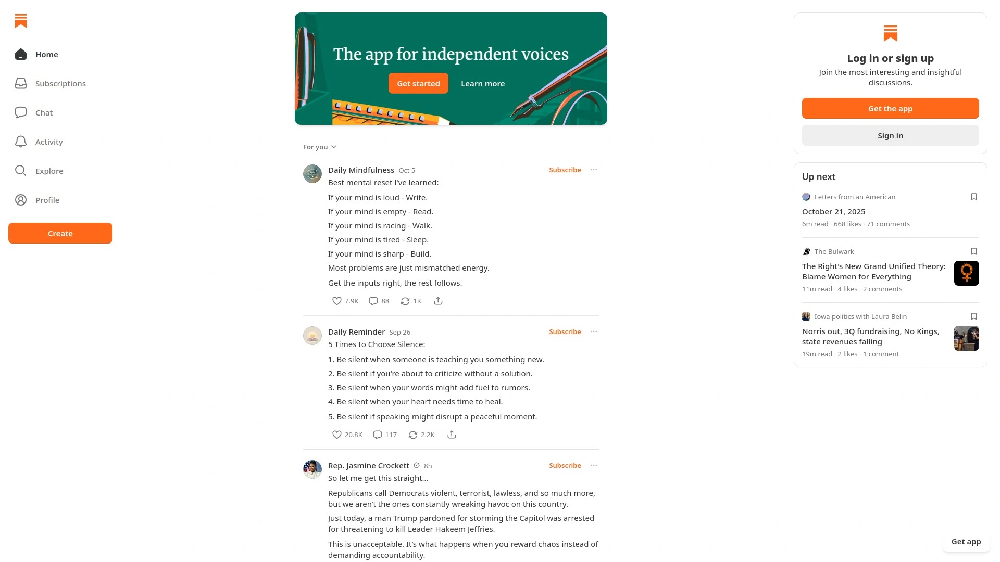

Substack popularized paid newsletters by making subscription writing accessible to anyone. Write in their simple editor, hit publish, and content goes to email subscribers and lives on your hosted publication site. Free subscribers see some content while paid members access everything. This freemium model lets you build audience before asking for money, reducing the barrier to starting.

The 10% revenue cut applies only to paid subscriptions, not free newsletters. This structure aligns Substack's success with yours—they profit when you do. The simplicity attracts writers wanting to focus on writing rather than managing technical platforms. No design decisions, plugin choices, or hosting concerns. Just write, publish, get paid.

Discovery features help readers find new publications through recommendations and the Substack network. However, most successful writers bring existing audiences from social media or other platforms. The writing-focused tools lack features course creators or coaches need—no video hosting, course structures, or coaching calendars. Substack works brilliantly for journalists, essayists, and newsletter writers but serves other creator types poorly. Know whether you're primarily writing before choosing Substack over more versatile platforms.

***

## FAQ

**Should I use a marketplace or self-hosted platform for my courses?**

Marketplaces like Udemy and Skillshare provide instant access to millions of potential students without marketing effort, ideal for beginners building portfolios and validating course topics. However, you sacrifice pricing control, keep lower revenue percentages, and never own the customer relationship. Self-hosted platforms like Thinkific or Teachable require driving your own traffic but let you keep 90%+ of revenue, control pricing completely, and build email lists you own. Most successful creators eventually move to self-hosted platforms after proving concepts on marketplaces.

**How much does it realistically cost to run a creator monetization platform?**

Budget $50-150 monthly for the platform itself, depending on features needed. Add $15-50 monthly for email marketing if not included. Factor in payment processing fees around 3% of sales. Video hosting sometimes costs extra on cheaper plans. Total realistic budget runs $100-250 monthly before considering content creation costs like equipment, editing software, or contractor help. Free plans exist but limit growth through transaction fees or restricted features—fine for testing but expensive at scale.

**Can I really make full-time income from online courses or coaching?**

Yes, but timeline and income vary dramatically by niche, audience size, and pricing strategy. Creators with existing audiences of 5,000-10,000 engaged followers often generate $3,000-10,000 monthly within 6-12 months of launching paid offerings. Starting from zero audience takes 12-24 months building free content before monetization becomes viable. Success requires consistent content creation, audience engagement, and refining offerings based on feedback—not passive income from launching once. The business model works but demands ongoing effort and patience during early growth phases.

***

## Wrapping This Up

The creator monetization landscape splits between marketplace platforms offering instant reach with limited control and self-hosted solutions providing autonomy at the cost of handling your own marketing. Your choice depends on whether you have an existing audience to convert or need discovery mechanisms while building following. For coaches and experts wanting comprehensive tools combining live sessions, recorded courses, memberships, and dedicated strategic support within one system, [Wooskill](https://www.wooskill.com/creators) delivers infrastructure plus hands-on guidance that self-service platforms don't provide. The personal account manager support and multi-format flexibility make it particularly valuable for creators who know their expertise but need help with pricing strategy, positioning, and technical optimization—transforming knowledge into structured offerings that audiences actually purchase.
